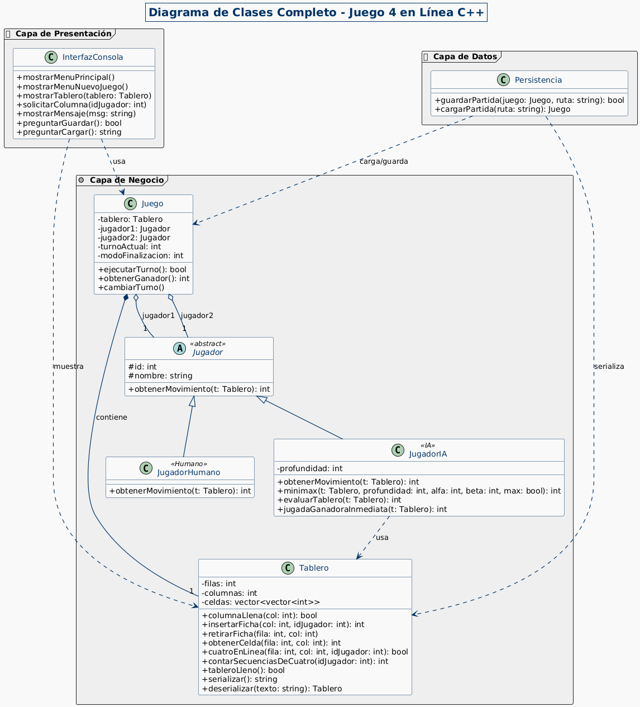
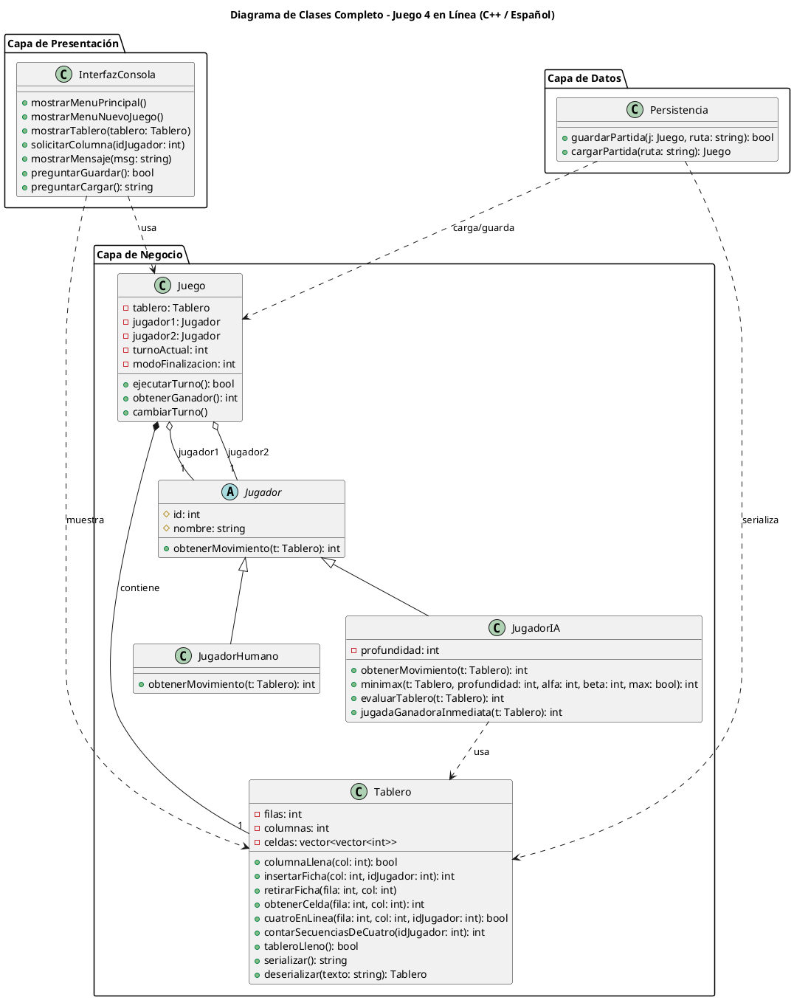

# Juego 4 en Línea (C++)

Este proyecto es una implementación en C++ del clásico juego "4 en Línea" ("Connect 4"). Fue desarrollado como parte de la asignatura "Estructuras de Datos", siguiendo una arquitectura de software de 3 capas para asegurar una correcta separación de responsabilidades y un código mantenible.

## Características Actuales
- **Menú de Juego**: Permite seleccionar diferentes modos de juego: Humano vs. Humano, Humano vs. IA, y IA vs. IA.
- **Tablero Funcional**: El tablero de 6x7 está implementado y los jugadores pueden colocar fichas por turnos.
- **Sistema de Turnos**: El juego alterna correctamente entre el jugador 1 y el jugador 2.
- **Compilación Multiplataforma**: Utiliza **CMake** como sistema de compilación, lo que permite generar los archivos de proyecto nativos en diferentes sistemas operativos (Windows, Linux, macOS) sin cambiar el código.
- **Persistencia Básica**: Implementada la capacidad de guardar y cargar partidas, aunque con limitaciones (ver tareas pendientes).

---

## Arquitectura del Sistema

El proyecto sigue un **modelo de 3 capas**, garantizando que cada parte del programa tenga una única responsabilidad.

### 1. Capa de Presentación
Responsable de toda la interacción con el usuario. No contiene ninguna lógica de juego.

- `InterfazConsola`:
  - **Rol**: Muestra los menús, dibuja el estado actual del tablero en la consola y solicita al usuario que introduzca datos (opciones o columnas).
  - **Lógica**: Actúa como un "intérprete" entre el usuario y la capa de negocio.

### 2. Capa de Negocio
El cerebro de la aplicación. Contiene todas las reglas, la lógica y el estado del juego.

- `Tablero`:
  - **Rol**: Representa el tablero de juego.
  - **Lógica**: Almacena la posición de las fichas en una matriz. Sabe cómo insertar una ficha en una columna (dejándola "caer") y puede detectar si una columna o el tablero entero están llenos. **Aquí es donde debe vivir la lógica de victoria.**

- `Jugador` (Clase Abstracta):
  - **Rol**: Define la interfaz común para cualquier tipo de jugador.
  - **Lógica**: Declara el método virtual puro `obtenerMovimiento()`, obligando a que todas las clases hijas (como `JugadorHumano` o `JugadorIA`) implementen su propia manera de decidir una jugada.

- `JugadorHumano` y `JugadorIA`:
  - **Rol**: Representan los dos tipos de jugadores posibles.
  - **Lógica**: `JugadorHumano` obtiene su movimiento directamente de la entrada del usuario a través de la `InterfazConsola`. `JugadorIA` debe contener el algoritmo para decidir la mejor jugada de forma autónoma.

- `Juego`:
  - **Rol**: Es el director de orquesta. Une todas las piezas de la capa de negocio.
  - **Lógica**: Contiene el tablero y los dos jugadores. Gestiona el flujo de la partida, controla los turnos y ejecuta las jugadas.

### 3. Capa de Datos
Responsable de la comunicación con el almacenamiento externo (archivos de texto).

- `Persistencia`:
  - **Rol**: Guarda el estado de una partida en un archivo y lo recupera.
  - **Lógica**: "Serializa" el estado del objeto `Juego` (lo convierte a texto) y lo escribe en un archivo. También puede leer ese archivo para "deserializar" y reconstruir un objeto `Juego`.

---

## Diagrama de Clases



<details>
<summary>Ver Código PlantUML del Diagrama</summary>



</details>

---

## Cómo Compilar y Ejecutar

El proyecto utiliza **CMake**, por lo que necesitarás tener `cmake`, `make` y un compilador de C++ (como `g++`) instalados.

```bash
# 1. Clona el repositorio
git clone <URL-DEL-REPOSITORIO>
cd <NOMBRE-DEL-DIRECTORIO>

# 2. Crea un directorio de compilación (build) y entra en él
# (Esto mantiene el código fuente limpio)
mkdir build
cd build

# 3. Ejecuta CMake para generar los archivos de compilación
# (CMake leerá el archivo CMakeLists.txt del directorio padre)
cmake ..

# 4. Compila el proyecto usando make
make

# 5. Ejecuta el juego
# El ejecutable se encontrará dentro del directorio 'build'
./Juego4EnLinea
```

---

## ⛔ Pendientes y Tareas Faltantes ⛔

Esta sección es una guía para el equipo sobre las partes críticas que **necesitan ser implementadas** para que el juego esté completo según los requisitos.

### 1. Lógica de Victoria (Crítico)
- **Tarea**: Implementar el método `bool Tablero::cuatroEnLinea(int fila, int col, int idJugador) const`.
- **Descripción**: Actualmente, el método está vacío y siempre devuelve `false`. Es la **prioridad número 1**. Debe ser llamado después de cada inserción de ficha para verificar si la nueva ficha ha completado una línea de 4 en horizontal, vertical o en las dos diagonales. Sin esto, nadie puede ganar.

### 2. Inteligencia Artificial (Crítico)
- **Tarea**: Implementar los métodos de la clase `JugadorIA`.
- **Descripción**: El método `obtenerMovimiento()` de la IA está vacío. Se debe implementar un algoritmo para la toma de decisiones. El requisito sugiere una IA que intente ganar, por lo que un algoritmo **Minimax** (posiblemente con poda Alfa-Beta) es la opción ideal.
- **Sub-tareas**:
    - Implementar `JugadorIA::minimax()`: El núcleo del algoritmo recursivo.
    - Implementar `JugadorIA::evaluarTablero()`: Una función de ayuda para Minimax que asigne una puntuación a un estado del tablero (qué tan favorable es para la IA).

### 3. Modalidad de Juego por Puntuación
- **Tarea**: Implementar el método `int Tablero::contarSecuenciasDeCuatro(int idJugador) const`.
- **Descripción**: Para cumplir con la segunda modalidad de juego (ganar por puntos cuando el tablero se llena), este método debe recorrer todo el tablero y contar cuántas secuencias de 4 en línea ha formado un jugador. Actualmente está vacío.

### 4. Persistencia de Datos Mejorada
- **Tarea**: Mejorar la función `Persistencia::cargarPartida()`.
- **Descripción**: La función actual carga correctamente los tipos de jugador (Humano o IA), pero **no restaura el estado exacto del tablero ni de quién era el turno**. Es necesario modificar la serialización y deserialización para que al cargar una partida, esta continúe exactamente donde se dejó.